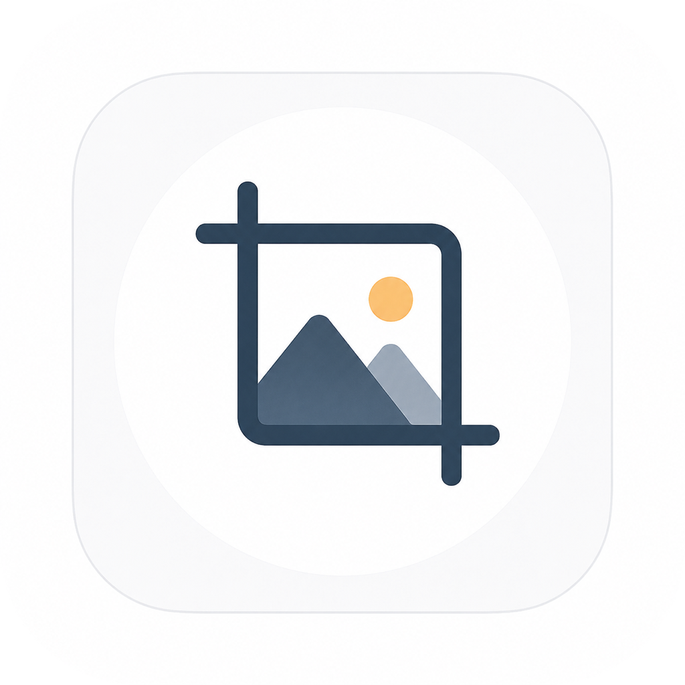

<div align="center">



# ImageCrop

**A customizable image cropping component for Compose Multiplatform.**

[](https://search.maven.org/)
[](LICENSE)
[](https://kotlinlang.org)
[](https://www.jetbrains.com/compose-multiplatform/)

Android · iOS · Desktop · Web

</div>

---

`ImageCrop` is a lightweight, fully interactive image-cropping widget for [Compose Multiplatform](https://www.jetbrains.com/compose-multiplatform/). Drag the crop rectangle, pinch to zoom, choose from seven aspect-ratio presets, and get the result back at full source resolution — all from a single composable that runs unchanged on every supported platform.

## Platform Support

| Platform | Status | Backing image type |
|----------|:------:|--------------------|
| Android | ✅ | `android.graphics.Bitmap` |
| iOS | ✅ | Encoded bytes (Skia) |
| Desktop (JVM) | ✅ | `java.awt.image.BufferedImage` |
| Web (JS) | ✅ | Encoded bytes (Skia) |
| Web (WasmJS) | ✅ | Encoded bytes (Skia) |

## Demos

<!--
  Add a screen-recording (GIF or MP4) per platform below.
  Easiest way on GitHub: open a new issue, drag-and-drop the video into the
  comment box, copy the generated URL, and paste it into the matching cell.
  Alternatively, commit the files under docs/ and reference them here.
-->

| Platform | Demo |
|----------|------|
| Android | _add demo here_ |
| iOS | _add demo here_ |
| Desktop | _add demo here_ |
| Web | _add demo here_ |

## Features

- **Seven crop modes** — free-form, square, circular profile, and fixed ratios (3:2, 4:3, 16:9, 9:16).
- **Circular profile crop** — `PROFILE_CIRCLE` overlays a circular mask for avatar-style cropping.
- **Pinch-to-zoom & pan** — optional gesture zoom (1×–5×) with double-tap to toggle.
- **Two handle styles** — circular dots or square brackets at the corners.
- **Rule-of-thirds guides** — optional grid overlay while cropping.
- **Full-resolution output** — the crop maps back to source-image pixels, not the on-screen canvas.
- **Config-change safe** — crop rectangle, zoom, and pan survive rotation via `rememberSaveable`.
- **One API, every platform** — identical Compose code across Android, iOS, Desktop, and Web.

## Installation

> ⚠️ **Not yet published to Maven Central.** The coordinates below are final but the artifact is not live yet; they will resolve once version `0.1.0` is published.

**`gradle/libs.versions.toml`**

```toml
[versions]
cmpImgCropView = "0.1.0"

[libraries]
cmpImgCropView = { module = "io.github.rroohit:CmpImgCropView", version.ref = "cmpImgCropView" }
```

**`build.gradle.kts`** (shared / `commonMain`)

```kotlin
kotlin {
    sourceSets {
        commonMain.dependencies {
            implementation(libs.cmpImgCropView)
        }
    }
}
```

<details>
<summary>Without a version catalog</summary>

```kotlin
commonMain.dependencies {
    implementation("io.github.rroohit:CmpImgCropView:0.1.0")
}
```

</details>

## Quick Start

```kotlin
@Composable
fun MyCropScreen(imageData: ImageData) {
    // 1. Hold the crop state (survives rotation/config changes).
    val imageCrop = rememberSaveableImageCrop(imageData)

    Column {
        // 2. Render the interactive crop view.
        ImageCropView(
            imageCrop = imageCrop,
            modifier = Modifier.weight(1f),
            cropType = CropType.FREE_STYLE,
            enableZoom = true,
        )

        // 3. Retrieve the cropped result at full resolution.
        Button(onClick = {
            val cropped: ImageData = imageCrop.onCrop()
            // Display it, upload it, save it…
        }) {
            Text("Crop")
        }
    }
}
```

To display any `ImageData` (including the crop result) in Compose, convert it with `toImageBitmap()`:

```kotlin
Image(bitmap = cropped.toImageBitmap(), contentDescription = null)
```

## Creating an `ImageData`

`ImageData` is the library's platform-agnostic image container (an `expect class` with an `actual` implementation per platform). You construct it in each platform's source set from that platform's native image type, then pass it into shared code.

**Android** (`androidMain`)

```kotlin
import com.cmp.image.cropview.ImageData

val imageData = ImageData(bitmap) // android.graphics.Bitmap
```

**Desktop / JVM** (`jvmMain`)

```kotlin
import com.cmp.image.cropview.ImageData

val imageData = ImageData(bufferedImage) // java.awt.image.BufferedImage
```

**iOS** (`iosMain`)

```kotlin
import com.cmp.image.cropview.ImageData

// encodedBytes = PNG/JPEG bytes; width/height = pixel dimensions
val imageData = ImageData(encodedBytes, width, height)
```

**Web — JS & WasmJS** (`webMain`)

```kotlin
import com.cmp.image.cropview.ImageData

val imageData = ImageData(width, height, encodedBytes)
```

## API Reference

### `ImageCropView`

| Parameter | Type | Default | Description |
|-----------|------|---------|-------------|
| `imageCrop` | `ImageCrop` | — | State holder from `rememberImageCrop` / `rememberSaveableImageCrop`. |
| `modifier` | `Modifier` | `Modifier` | Layout modifier for the crop view container. |
| `guideLineColor` | `Color` | `Color(0xFFD1CBE2)` | Colour of the border and rule-of-thirds grid. |
| `guideLineWidth` | `Dp` | `2.dp` | Stroke width of the guide lines. |
| `edgeCircleSize` | `Dp` | `8.dp` | Radius of the corner handles (when `edgeType = CIRCULAR`). |
| `showGuideLines` | `Boolean` | `true` | Whether to draw the rule-of-thirds grid. |
| `cropType` | `CropType` | `FREE_STYLE` | Aspect-ratio constraint (see below). |
| `edgeType` | `EdgeType` | `CIRCULAR` | Corner handle style. |
| `enableZoom` | `Boolean` | `false` | Enables pinch-to-zoom and double-tap zoom. |

### `CropType`

| Value | Ratio | Notes |
|-------|-------|-------|
| `FREE_STYLE` | none | Resize freely to any proportion. |
| `SQUARE` | 1:1 | Locked square. |
| `PROFILE_CIRCLE` | 1:1 | Square selection with a circular overlay mask. |
| `RATIO_3_2` | 3:2 | Landscape. |
| `RATIO_4_3` | 4:3 | Standard. |
| `RATIO_16_9` | 16:9 | Widescreen. |
| `RATIO_9_16` | 9:16 | Portrait / stories. |

`CropType.aspectRatio(): Float?` returns the numeric ratio, or `null` for `FREE_STYLE`, `SQUARE`, and `PROFILE_CIRCLE`.

### `EdgeType`

`CIRCULAR` — round dots at the corners. `SQUARE` — square bracket handles.

### `ImageCrop` / `OnCrop`

| Member | Description |
|--------|-------------|
| `onCrop(cropSourceImage: Boolean = true): ImageData` | Performs the crop. `true` (default) maps the selection back to source pixels for full-resolution output; `false` returns the canvas-scaled (lower quality) crop. |
| `resetView()` | Resets the crop rectangle and zoom to their initial state. |

### State factories

| Factory | Behaviour |
|---------|-----------|
| `rememberImageCrop(imageData)` | In-process state; **not** preserved across activity recreation. |
| `rememberSaveableImageCrop(imageData)` | Crop rect, zoom, and pan survive rotation and config changes. Resets automatically when `imageData` changes. |

## Recipes

**Profile-picture cropper** — circular mask, no grid:

```kotlin
ImageCropView(
    imageCrop = imageCrop,
    cropType = CropType.PROFILE_CIRCLE,
    showGuideLines = false,
    enableZoom = true,
)
```

**Fixed 16:9 banner crop:**

```kotlin
ImageCropView(
    imageCrop = imageCrop,
    cropType = CropType.RATIO_16_9,
)
```

**Custom styling with square handles:**

```kotlin
ImageCropView(
    imageCrop = imageCrop,
    edgeType = EdgeType.SQUARE,
    guideLineColor = Color.White,
    guideLineWidth = 1.5.dp,
)
```

**Collecting multiple crops:**

```kotlin
var results by remember { mutableStateOf<List<ImageData>>(emptyList()) }

ImageCropView(imageCrop = imageCrop, enableZoom = true)

Button(onClick = { results = results + imageCrop.onCrop() }) { Text("Crop") }
OutlinedButton(onClick = { imageCrop.resetView() }) { Text("Reset") }

LazyRow {
    items(results) { img ->
        Image(bitmap = img.toImageBitmap(), contentDescription = null)
    }
}
```

## State Persistence

`rememberSaveableImageCrop` serializes the crop rectangle, zoom level, and pan offset as **normalized ratios**, so they restore correctly even when the canvas is laid out at a different size after a rotation or other configuration change. Because the factory keys on the `imageData` instance, loading a different image automatically starts with a fresh crop state.

## Running the Sample Apps

The repository includes a demo app (`:shared`) hosted on every platform:

```bash
# Android (device/emulator connected)
./gradlew :androidApp:installDebug

# Desktop (JVM)
./gradlew :desktopApp:run

# Web — JavaScript
./gradlew :webApp:jsBrowserDevelopmentRun

# Web — WebAssembly
./gradlew :webApp:wasmJsBrowserDevelopmentRun
```

For iOS, open the `iosApp/` project in Xcode and run it on a simulator or device.

## Compatibility

| Dependency | Version |
|------------|---------|
| Kotlin | 2.3.21 |
| Compose Multiplatform | 1.11.0 |
| Android `minSdk` | 24 |
| Android `compileSdk` | 36 |

## Contributing

Contributions are welcome. Please open an issue to discuss substantial changes before submitting a pull request at [github.com/rroohit/CmpImageCropView](https://github.com/rroohit/CmpImageCropView).

## License

```
Copyright 2026 Rohit Chavan

Licensed under the Apache License, Version 2.0 (the "License");
you may not use this file except in compliance with the License.
You may obtain a copy of the License at

    https://www.apache.org/licenses/LICENSE-2.0

Unless required by applicable law or agreed to in writing, software
distributed under the License is distributed on an "AS IS" BASIS,
WITHOUT WARRANTIES OR CONDITIONS OF ANY KIND, either express or implied.
See the License for the specific language governing permissions and
limitations under the License.
```

See [`LICENSE`](LICENSE) for the full text.